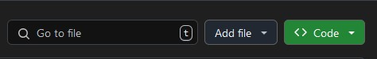
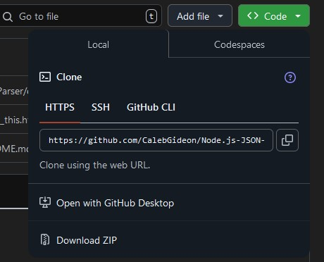
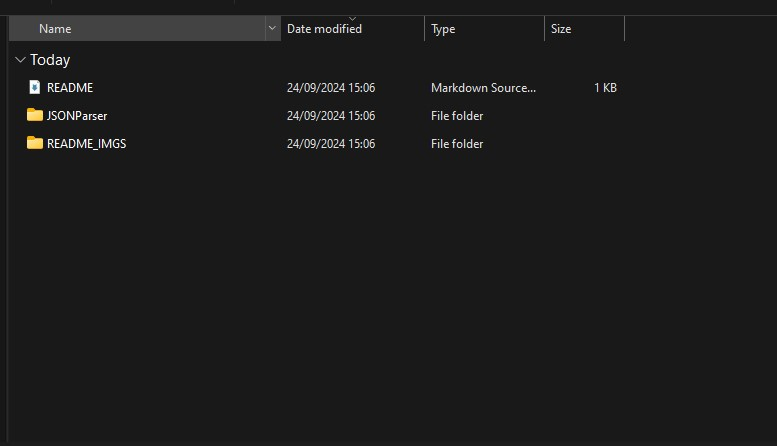
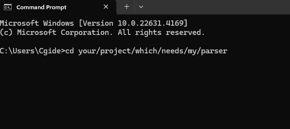
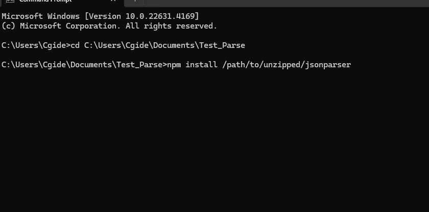
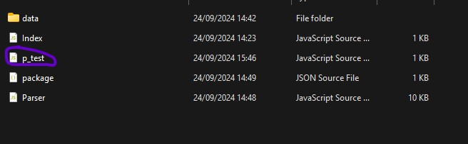

# ✍ Node.js-JSON-Parser ✍

  
A custom Json file Parser that can be used in Node.js projects, utilsing a three step lexing, tokenisation and parsing system to parse all relevant JSON files. Includes error checking. Installation instrutions and features below <b>NOTE: This parser requires Node.js to be installed on your device</b>

   <h2>Table of Contents</h2>
  <ul>
    <li><a href="#Setup">How to Setup</a></li>
    <li><a href="#Features">Features</a></li>
    <li><a href="Limitations">Limitations</a></li>
  </ul>

  <h2 id="section1">Breakdown</h2>

  <h2 id="Setup">How to Setup</h2>

  <ol>
    

    

    
    

    <li><b>To download the JSON parser files, click the <>code button on the right-hand side of the repository</b></li>
    

    

    

    
    

    <li><b>On the drop-down menu, select the bottom option to download the repository as a Zip</b></li>
    

    

    

    
    

    <li><b>Extract the JSON_Parser folder to a valid location on your pc (Documents or Desktop)</b></li>
    

    

    

    
    

    <li><b>Open cmd, and cd to your project folder that you want to add the downloaded parsing module</b></li>
    

    

    

    
    

    <li><b>Once your in the correct repository, install the JSON parser as above, specifying the directory folder of the JSON files (specifically the Node.js-JSON-Parser
/JSONParser folder which holds the Index.js, Parser.js, and package.json)</b></li>
    

    

    

    
    

    <li><b>Inside of the javascript file you wish parse data, import the parser with:</b></li>
      <pre><code>const { Parse } = require('jsonparser');</code></pre>
    

    

    

    

    
    

    <li><b>If you want to quickly test if it works. Grab the Test folder inside of the JSON Github repository, and drag it into the same folder as your working file. Then run this code:</b></li>
    <pre><code> var path = "./test_data/valid.json";
                const {Parse} = require('jsonparser');
                const fs = require('fs');
                fs.readFile(path, 'utf8', (err, data) => {
                if(err) {
                  console.error(err);
                  return;
                }
                var parsed = Parse(data);
                console.log(parsed);
                });</code></pre>
    

  </ol>

